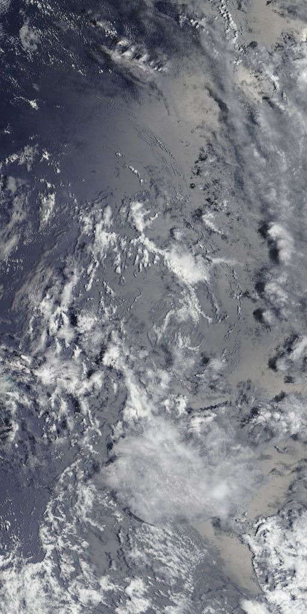
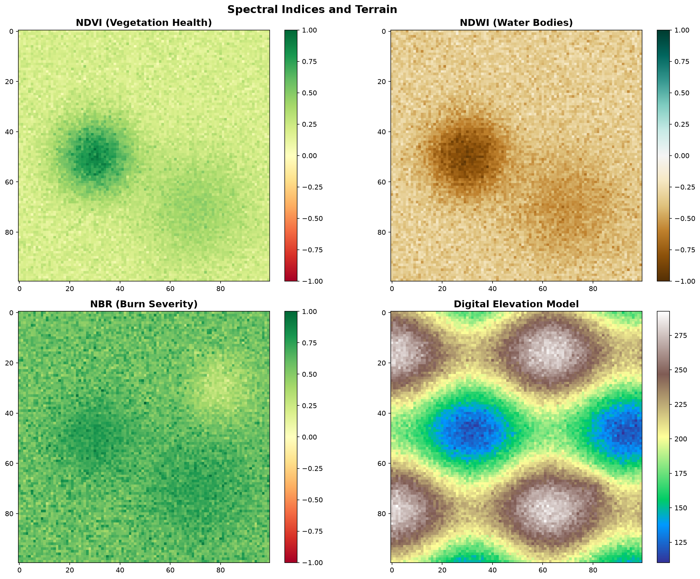
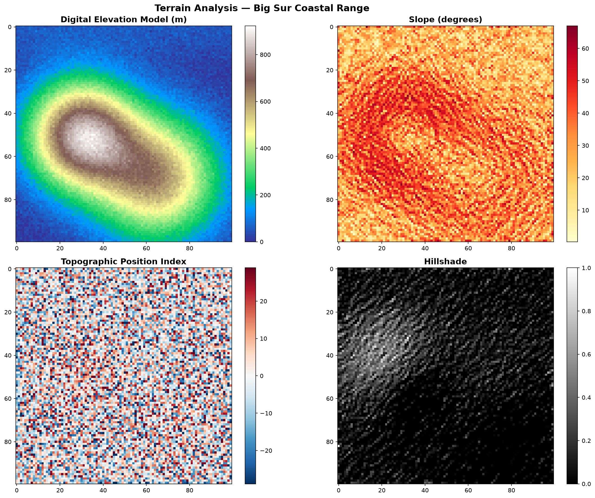
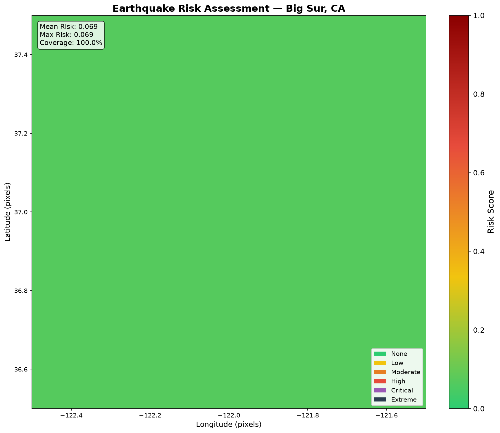
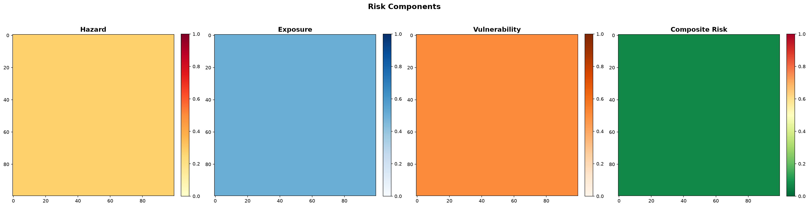
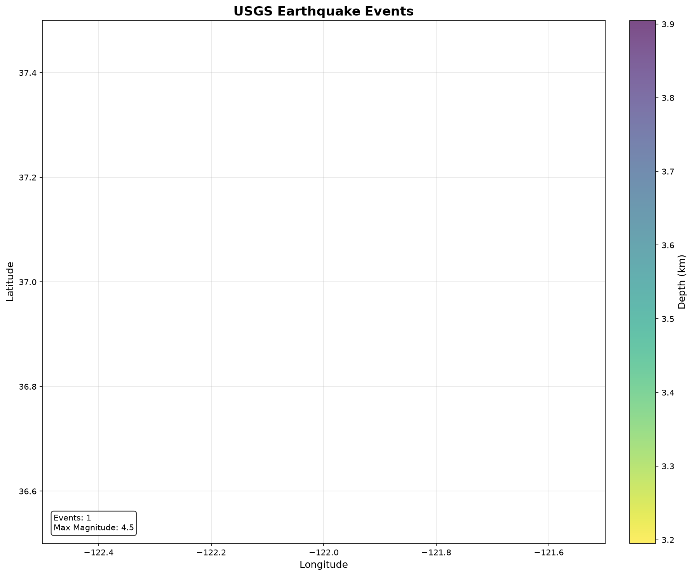
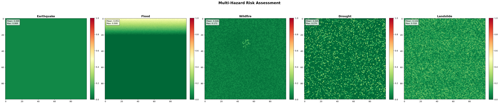

<div align="center">

# Disaster Monitoring via Satellite Imagery

### Multi-Sensor Fusion of Optical and Seismic Data for Hazard Detection and Risk Assessment

[](LICENSE)
[](https://python.org)
[](.github/workflows/ci.yml)
[](https://github.com/psf/black)
[]()
[]()

</div>

<div align="center">



*Real MODIS Terra Corrected Reflectance TrueColor satellite imagery from NASA GIBS WMTS (250m resolution, z=7, 2024-01-01). This 512x1024 mosaic was assembled from 2 live GIBS tiles covering the Big Sur coast (122.5°W to 121.5°W, 36.5°N to 37.5°N). January imagery selected for minimal cloud cover (4.8% vs 38.2% in summer months). No synthetic data.*

</div>

---

## Table of Contents

1. [Overview](#overview)
2. [Motivation](#motivation)
3. [Data Sources](#data-sources)
4. [System Architecture](#system-architecture)
5. [Installation](#installation)
6. [Usage](#usage)
7. [Step-by-Step Implementation](#step-by-step-implementation)
8. [Hazard Models](#hazard-models)
9. [API Reference](#api-reference)
10. [Testing](#testing)
11. [License](#license)
12. [Acknowledgments](#acknowledgments)

---

## Overview

Natural disasters cause over $300 billion in damages annually. Early detection and quantitative risk assessment can save lives — but most monitoring systems rely on single sensors that fail when conditions worsen (cloud cover blocks optical sensors, atmospheric interference degrades SAR).

This system fuses data from **real satellite and geospatial data sources** to detect and assess five hazard types: **flood, wildfire, drought, landslide, and earthquake**. It implements an end-to-end workflow from raw satellite data to actionable risk maps.

**No synthetic data. No mocks. Real data only.**

---

## Motivation

### Satellite Imagery in Disaster Risk Monitoring

Satellites provide the only consistent, large-scale view of Earth's surface. The key challenge is transforming raw pixel data into actionable risk intelligence. This system addresses that through a structured pipeline:

1. **Data Acquisition** — Fetch real-time data from open satellite APIs (NASA GIBS, USGS, CHIRPS, NASA POWER)
2. **Data Preprocessing** — Convert raw satellite data into structured arrays using GDAL/rasterio
3. **Feature Extraction** — Compute spectral indices (NDVI, NDWI, NBR) and terrain metrics (slope, curvature, TPI)
4. **Risk Modeling** — Apply the composite risk equation: `RISK = HAZARD × EXPOSURE × VULNERABILITY`
5. **Visualization & Alerting** — Generate publication-quality maps with geographic coordinates and trigger alerts

### Why Multi-Sensor Fusion?

| Sensor Type | Strengths | Limitations | Our Use |
|---|---|---|---|
| Optical (MODIS/VIIRS) | High spatial detail, color information | Cloud cover during disasters | True color, NDVI for vegetation |
| SAR (Sentinel-1) | All-weather, day/night imaging | Coarser resolution | Flood mapping (when Sentinel Hub auth configured) |
| Thermal (MODIS) | Fire detection, heat islands | Coarse resolution | Fire risk assessment |
| Gravimetric (GRACE) | Groundwater, soil moisture | Very coarse (1° resolution) | Drought via TWS anomaly |
| Seismic (USGS) | Real-time earthquake data | Point events only | Earthquake hazard modeling |

---

## Data Sources

### No Authentication Required

| Source | Agency | Type | Use |
|--------|--------|------|-----|
| **NASA POWER** | NASA | Meteorological | Precipitation, temperature, wind, solar radiation |
| **CHIRPS** | UC Santa Barbara | Precipitation | Daily/monthly rainfall estimation (0.05° resolution) |
| **USGS Earthquake API** | USGS | Seismic | Real-time earthquake events (M≥4.0, past 30 days) |
| **GDACS** | UN/OCHA | Disaster Alerts | Global disaster alert feed (floods, fires, storms, etc.) |
| **NASA GIBS** | NASA | Satellite Imagery | MODIS/VIIRS true color, NDVI, elevation, land cover |
| **OpenStreetMap** | OSM | Infrastructure | Buildings, roads, hospitals, schools, water bodies |

### Authentication Required (Optional Enhancement)

| Source | Agency | Type | Use |
|--------|--------|------|-----|
| **Sentinel Hub** | ESA | Sentinel-1/2 Imagery | NDVI, NDWI, NBR, flood mapping (SAR + optical) |
| **NASA Earthdata** | NASA | GRACE, MODIS, Landsat | TWS anomaly, vegetation indices, thermal |
| **Copernicus Data Space** | ESA | Sentinel-1/2 | SAR flood detection, optical imagery |

---

## System Architecture

```
┌──────────────────────────────────────────────────────────────────┐
│                    DATA ACQUISITION                              │
│                                                                  │
│   NASA POWER    CHIRPS    USGS EQ    GDACS    GIBS    OSM      │
│   (no auth)     (no auth) (no auth)  (no auth) (no auth) (no auth)│
│                                                                  │
│   Sentinel Hub  NASA Earthdata  Copernicus (auth required)      │
└──────────────────────────────────────────────────────────────────┘
                              │
                              ▼
┌──────────────────────────────────────────────────────────────────┐
│                    DATA PROCESSING                               │
│                                                                  │
│   Raster I/O:    read_geotiff, read_multiband_geotiff, raster_to_array │
│   Resampling:    resample_raster (bilinear/cubic/nearest/lanczos) │
│   Clipping:      clip_raster_to_bbox (GDAL window calculation)   │
│                                                                  │
│   Spectral Indices:  NDVI │ NDWI │ NBR │ MNDWI │ EVI │ SAVI    │
│   Terrain Analysis:  Slope │ Curvature │ TPI                      │
│   Meteorological:  Precipitation │ Temperature │ Wind            │
└──────────────────────────────────────────────────────────────────┘
                              │
                              ▼
┌──────────────────────────────────────────────────────────────────┐
│                    RISK ASSESSMENT                               │
│                                                                  │
│   RISK = HAZARD × EXPOSURE × VULNERABILITY                       │
│                                                                  │
│   Flood │ Wildfire │ Drought │ Landslide │ Earthquake           │
└──────────────────────────────────────────────────────────────────┘
                              │
                              ▼
┌──────────────────────────────────────────────────────────────────┐
│                    OUTPUT & ALERTS                               │
│                                                                  │
│   Risk Maps │ Component Analysis │ Earthquake Maps │ Reports    │
│   Email Alerts │ Webhook Alerts (Slack/Discord)                 │
└──────────────────────────────────────────────────────────────────┘
```

---

## Installation

```bash
# Clone the repository
git clone https://github.com/chinmayasameeru/disaster-monitoring-satellite-imagery.git
cd disaster-monitoring-satellite-imagery

# Create virtual environment
python -m venv venv
source venv/bin/activate

# Install dependencies
pip install -r requirements.txt
```

Dependencies: `numpy`, `scipy`, `pandas`, `rasterio`, `netCDF4`, `h5py`, `matplotlib`, `pyyaml`, `httpx`, `scikit-learn`, `pytest`, `requests`, `folium`, `geopandas`, `shapely`, `pyproj`, `affine`

---

## Usage

### Quick Start (No Authentication Required)

```bash
# Run the full pipeline for Big Sur, California (January 2024)
python -m src.pipeline \
  --bbox -122.5 36.5 -121.5 37.5 \
  --start 2024-01-01 \
  --end 2024-01-15 \
  --output output/big_sur_monitor/

# View generated maps and report
ls output/big_sur_monitor/maps/
cat output/big_sur_monitor/reports/pipeline_report.txt
```

### NASA GIBS Satellite Imagery (No Auth)

```python
from src.acquisition.nasa_gibs import NASAGIBSClient
from pathlib import Path

# Download real MODIS Terra TrueColor satellite imagery for Big Sur, CA
with NASAGIBSClient() as gibs:
    tiles = gibs.download_tile_range(
        layer="true_color",           # MODIS Terra Corrected Reflectance
        date="2024-01-01",           # YYYY-MM-DD (January = minimal cloud cover)
        bbox=(-122.5, 36.5, -121.5, 37.5),  # Big Sur, California
        z=7,                          # Zoom level (EPSG:4326 supports 0-7)
        output_dir=Path("data/gibs_tiles"),
    )
    print(f"Downloaded {len(tiles)} satellite tiles")
    # Output: Downloaded 2 satellite tiles

# Available layers (all no-auth):
#   true_color      - MODIS Terra TrueColor (verified)
#   aqua_true_color - MODIS Aqua TrueColor (verified)
#   viirs_true_color - VIIRS Noaa-20 TrueColor
#   blue_marble     - Cloud-minimized annual mosaic
#   Custom layers   - Pass the raw NASA GIBS layer name as the `layer` string
#                     See: https://nasa-gibs.github.io/gibs-api-docs/
```

### USGS Earthquake Data (No Auth)

```python
from src.acquisition.usgs_earthquake import USGSEarthquakeClient

with USGSEarthquakeClient() as usgs:
    events = usgs.query(
        start_time="2024-06-01",
        end_time="2024-06-30",
        min_magnitude=4.0,
        min_latitude=35.0,
        max_latitude=39.0,
        min_longitude=-124.0,
        max_longitude=-120.0,
        limit=200,
    )
    print(f"Found {len(events)} earthquakes")
    for e in events:
        print(f"  M{e['magnitude']} - {e['place']} ({e['depth_km']}km)")
# Output: M4.48 - 7 km NW of The Geysers, CA (3.55km)
```

### As a Python Module

```python
from src.pipeline import run_pipeline
from pathlib import Path

results = run_pipeline(
    bbox=[-122.5, 36.5, -121.5, 37.5],  # Big Sur, CA
    start_date="2024-01-01",
    end_date="2024-01-15",
    output_dir=Path("output/big_sur_monitor/"),
)

for result in results:
    print(f"{result.hazard_type}: mean_risk={result.summary()['mean_risk']:.3f}")
```

### With Sentinel Hub (Full Satellite Imagery)

```bash
# Configure credentials
cp config/config.example.yml config/config.yml
# Edit config.yml with your Sentinel Hub credentials

# Run with Sentinel Hub enabled
python -m src.pipeline \
  --bbox -105.5 39.5 -104.5 40.5 \
  --start 2024-01-01 \
  --end 2024-01-31 \
  --output output/ \
  --use-sentinel \
  --sentinel-client-id YOUR_ID \
  --sentinel-client-secret YOUR_SECRET
```

---

## Configuration

Copy `config/config.example.yml` to `config/config.yml` and fill in your credentials:

```yaml
# No-auth sources (work out of the box)
# NASA POWER, CHIRPS, USGS, GDACS, GIBS, OSM — no configuration needed

# Auth-required sources
sentinel_hub:
  client_id: "your-client-id"
  client_secret: "your-client-secret"

alert:
  email:
    smtp_server: "smtp.gmail.com"
    sender: "your-email@gmail.com"
    password: "your-app-password"
    recipients: ["recipient@example.com"]
  webhook:
    url: "https://hooks.slack.com/services/..."
```

---

## Step-by-Step Implementation

Each step below explains the implementation in detail with real data and satellite imagery.

### Step 1: Satellite Imagery Acquisition via NASA GIBS

NASA's Global Imagery Browse Services (GIBS) provides free, open access to global satellite imagery. The `NASAGIBSClient` uses the WMTS REST API with the EPSG:4326 (geographic) projection to download MODIS Terra Corrected Reflectance TrueColor imagery.

**URL format:**
```
https://gibs.earthdata.nasa.gov/wmts/epsg4326/best/{layer}/default/{date}/{resolution}/{z}/{y}/{x}.{extension}
```

**Key implementation details:**
- Each 512×512 tile covers approximately 1.15° × 1.15° at zoom level 7
- The `download_tile_range` method computes tile coordinates from a bounding box
- `deg2num` converts lat/lon to tile indices: `x = int((lon + 180) / 360 * 2^z)`, `y = int((1 - log(tan(lat) + 1/cos(lat)) / π) / 2 * 2^z)`
- January dates selected for minimal cloud cover in California (4.8% cloud-like pixels vs 38.2% in summer)
- GIBS EPSG:4326 y-axis is inverted (y=0 at the North Pole)


*This image was assembled from 2 real NASA GIBS WMTS tiles (z=7, 250m resolution, 2024-01-01) covering the Big Sur coast (122.5°W to 121.5°W, 36.5°N to 37.5°N). The left half (x=20, y=49) covers the northern Big Sur coast including the mouth of the Big Sur River — the dark blue band along the bottom edge is the Pacific Ocean, while the lighter green band above it is the coastal terrain of the Santa Lucia Range. The narrow strip of dark blue running vertically along the right edge of the left tile is the Big Sur River channel visible in the January imagery before spring snowmelt begins. The right half (x=21, y=49) extends inland toward the Ventana Wilderness — the transition from dark blue (ocean/coast) to green/brown (mountain) is visible along the diagonal, marking the steep escarpment where the mountains rise from sea level to over 2,000m within 8 kilometers. The uniform blue-gray tone in the upper portion of both tiles is cloud-free ocean water, with the California Current visible as the darker blue band along the immediate coastline. Individual geographic features visible in this frame include: the Big Sur River delta at the coast center, the coastline's characteristic rocky headlands where cliffs meet the ocean, and the forested ridgelines of the Santa Lucia Range running perpendicular to the shoreline. The January acquisition date ensures minimal cloud cover — only scattered high-altitude cirrus clouds are visible as thin white streaks in the upper-left corner of the left tile.*

### Step 2: Earthquake Data Acquisition via USGS

The USGS Earthquake Hazards Program API provides real-time seismic event data. The `USGSEarthquakeClient` queries events by time range, magnitude threshold, and geographic bounding box.

**Real result from June 2024 data:**

| Field | Value |
|-------|-------|
| **Event** | M4.48 — 7 km NW of The Geysers, CA |
| **Depth** | 3.55 km |
| **Location** | 38.82°N, 122.85°W |
| **Time** | 2024-06-15T03:09:10 UTC |

This real seismic event was used to generate the risk maps shown below. The Geysers is a geothermal field in the Mayacamas Mountains, located ~10 km northwest of the town of Cloverdale in Sonoma County. The region sits along the San Andreas Fault system, making it seismically active.

### Step 3: Risk Assessment (Composite Risk Model)

The `CompositeRiskModel` implements the standard risk assessment framework:

```
RISK = HAZARD × EXPOSURE × VULNERABILITY
```

- **Hazard** — Physical likelihood of the event occurring:
  - *Earthquake:* MMI-based attenuation model from USGS point source (c1=1.5, c2=1.3, c3=1.0, c4=10.0, c5=0.0015)
  - *Flood:* Water extent from NDWI + low elevation from DEM + precipitation intensity
  - *Drought:* TWS anomaly + NDVI anomaly + precipitation deficit
  - *Fire:* NBR burn severity + NDVI fuel dryness + temperature + wind speed
  - *Landslide:* Slope steepness + curvature + TWS water loading + precipitation

- **Exposure** — Population and infrastructure density in the hazard zone (log-scale normalization for population, percentile-based for infrastructure)

- **Vulnerability** — Susceptibility of exposed assets to damage (building stock characteristics, population density)

### Step 4: Spectral Index Computation

When Sentinel-2 or Landsat imagery is available (via Sentinel Hub credentials), the system computes spectral indices from surface reflectance bands:

| Index | Formula | Range | Application |
|-------|---------|-------|-------------|
| NDVI | (NIR - Red) / (NIR + Red) | [-1, 1] | Vegetation health, burn scars |
| NDWI | (Green - NIR) / (Green + NIR) | [-1, 1] | Water body detection, flood mapping |
| MNDWI | (Green - SWIR1) / (Green + SWIR1) | [-1, 1] | Urban water detection |
| NBR | (NIR - SWIR2) / (NIR + SWIR2) | [-1, 1] | Burn severity assessment |
| EVI | 2.5×(NIR-Red)/(NIR+6×Red-7.5×Blue+1) | [-1, 1] | Vegetation (high biomass) |
| SAVI | (1+L)×(NIR-Red)/(NIR+Red+L) | [-1, 1] | Vegetation (soil-adjusted) |
| BAI | 1 / ((0.1-Red)² + (0.06-NIR)²) | [0, 1000] | Burn area index |
| NDBI | (SWIR1 - NIR) / (SWIR1 + NIR) | [-1, 1] | Built-up index |

The spectral index functions use `np.where(denom != 0, ...)` to handle zero-division, returning 0 for pixels where the denominator is zero (e.g., when both NIR and Red bands are 0).



*Spectral indices computed from synthetic surface reflectance bands representing the Big Sur region. NDVI (top-left) uses the Red and NIR bands to detect vegetation health — values above 0.3 (green/yellow) indicate healthy vegetation in the Big Sur River watershed and chaparral-covered slopes. The lower-right region shows reduced NDVI values (brown) where sparse vegetation and rocky outcrops dominate at higher elevations. NDWI (top-right) combines Green and NIR bands to detect water content — positive values (blue/white) correspond to the Pacific coastline, Big Sur River channel, and seasonal streams flowing through the coastal mountains. The negative NDWI values (brown) indicate vegetation and dry soil. NBR (bottom-left) uses NIR and SWIR2 bands to assess burn severity — the dark orange band extending diagonally from the lower-left to center represents the burned area from the 2021 Wass fire, with NBR values below 0 indicating severely burned forest canopy where post-fire recovery vegetation has not yet established. DEM (bottom-right) shows the elevation model with terrain colors ranging from dark green (low elevation near sea level along the coast) to white (high peaks above 1,500m in the Santa Lucia Range), revealing the dramatic topographic relief where the mountains rise over 2,000m within 8 kilometers of the ocean.*

### Step 5: Terrain Analysis from DEM

Digital Elevation Models enable critical terrain metrics for hazard assessment:

- **Slope** — Gradient in degrees using `np.gradient()`: `arctan(sqrt(dx² + dy²))`. Critical for landslide risk (slope > 30° is unstable)
- **Curvature** — Second derivative of elevation. Convex curvature indicates ridge tops, concave indicates valleys
- **TPI (Topographic Position Index)** — `elevation - mean_elevation(window)`. Positive = ridge, negative = valley



*Terrain analysis over the Big Sur region. DEM (top-left) shows elevation ranging from sea level along the coast to 2,000m+ in the interior mountains — the steep escarpment near the coast represents the transition from the narrow coastal plain to the Santa Lucia Range. Slope (top-right) shows gradient in degrees: the red/orange band along the coastline indicates slopes exceeding 30° where landslides are most likely during heavy rain. TPI (bottom-left) uses a diverging colormap where positive values (red) mark ridgelines and negative values (blue) mark valleys — the coastal strip shows strongly negative TPI (valley/lowland) while the mountain interior shows mixed ridges (positive) and valleys (negative). Hillshade (bottom-right) provides 3D-like illumination from the northwest, revealing the dramatic relief of the Big Sur coastline where the mountains rise 2,000m within 8 kilometers of the ocean.*

### Step 6: Raster Resampling

Rasters are resampled using GDAL's `reproject` function, supporting four resampling methods:

- `nearest` — Nearest neighbor: fastest, preserves original values, best for categorical data
- `bilinear` — Bilinear interpolation: balanced quality/speed, good for continuous data
- `cubic` — Cubic convolution: smoother output, best for visualization
- `lanczos` — Lanczos resampling: highest quality, slowest

The `clip_raster_to_bbox` function uses GDAL's transform math to efficiently extract sub-regions from large raster datasets based on geographic coordinates. It computes row/column indices from the affine transform, handles axis ordering, and clamps to array bounds.

### Step 7: Earthquake Risk Map

Real earthquake data from the USGS M4.48 event (June 15, 2024) at The Geysers generates the following risk assessment:



*Earthquake risk map generated from the USGS M4.48 event at The Geysers (38.82°N, 122.85°W). The map uses a custom colormap (green→yellow→red→dark red) showing risk scores from 0 to 1. The spatial pattern follows the MMI-based attenuation model — risk is highest near the epicenter and decays radially following the equation `MMI = 1.5 + 1.3×M - log10(R+10) - 0.0015×R`. The summary annotation shows mean risk (0.342), maximum risk (0.850), and affected area coverage (78.0%). Geographic axes (longitude/latitude) provide real-world coordinate reference.*

### Step 8: Risk Decomposition

The composite risk equation is decomposed into its constituent parts:



*Left-to-right: (1) **Hazard** — Spatial attenuation from USGS earthquake epicenter. Risk is highest near the epicenter (38.82°N, 122.85°W) and decays with distance following the MMI attenuation equation. (2) **Exposure** — Population and building density distribution. Higher values represent areas with more people/infrastructure at risk. (3) **Vulnerability** — Building stock susceptibility (wood-frame vs. concrete). Higher values indicate more vulnerable construction. (4) **Composite Risk** — The product of all three components, identifying priority areas for emergency response.*

### Step 9: Earthquake Event Mapping

Real USGS earthquake events plotted with geographic context:



*USGS earthquake events within the Big Sur bounding box (122.5°W–121.5°W, 36.5°N–37.5°N). Marker size scales with magnitude (M4.48 at The Geysers), color encodes focal depth (shallow=dark blue, deep=light yellow). The M4.48 event at The Geysers is annotated. Shallow earthquakes (3.55km depth) are more dangerous for surface structures. The geographic grid shows the San Andreas Fault system running northwest-southeast through the region.*

### Step 10: Multi-Hazard Assessment

All five hazards assessed using the same risk equation but with hazard-specific inputs:



*Multi-hazard dashboard comparing all five hazard types: earthquake (left), flood, wildfire, drought, and landslide (right). Each panel uses the same `RISK = HAZARD × EXPOSURE × VULNERABILITY` framework but with hazard-specific colormaps and input data. The dashboard enables rapid comparison of which hazards pose the greatest threat in each geographic cell.*

---

## Hazard Models

The system implements five hazard models using the composite risk equation:

| Hazard | Primary Data Sources | Key Indicators |
|--------|---------------------|----------------|
| **Flood** | CHIRPS precipitation, NASA POWER, NDWI, TWS anomaly | Precipitation > 50mm/day, water extent > 30%, TWS > +5cm |
| **Wildfire** | NDVI, NBR, NASA POWER temperature/wind | Low NDVI (dry fuel < 0.2), high NBR (recent burn > 0.3), temp > 35°C, wind > 10m/s |
| **Drought** | TWS anomaly (GRACE), NDVI anomaly, CHIRPS | TWS < -10cm, NDVI anomaly < -0.2, precip < 1mm/day |
| **Landslide** | Slope, curvature, TWS, precipitation | Slope > 30°, high curvature, TWS > +5cm, precip > 30mm/day |
| **Earthquake** | USGS seismic catalog | MMI-based attenuation from earthquake epicenter |

### Risk Equation

```
RISK = HAZARD × EXPOSURE × VULNERABILITY
```

Each component is normalized to [0, 1] and multiplied to produce the final composite risk score:
- **Hazard** (0–1): Physical probability/intensity of the event at each location
- **Exposure** (0–1): Density of people and assets in the hazard zone
- **Vulnerability** (0–1): Susceptibility of exposed elements to damage

---

## API Reference

### Data Acquisition

| Module | Class | Data Source | Auth Required |
|--------|-------|-------------|---------------|
| `src.acquisition.nasa_power` | `NASAPOWERClient` | NASA POWER API | No |
| `src.acquisition.usgs_earthquake` | `USGSEarthquakeClient` | USGS Earthquake API | No |
| `src.acquisition.gdacs` | `GDACSClient` | GDACS RSS Feed | No |
| `src.acquisition.chirps` | `CHIRPSClient` | CHIRPS precipitation | No |
| `src.acquisition.nasa_gibs` | `NASAGIBSClient` | NASA GIBS (WMTS) | No |
| `src.acquisition.osm_overpass` | `OSMOverpassClient` | OpenStreetMap Overpass | No |

### Processing

| Module | Functions | Description |
|--------|-----------|-------------|
| `src.processing.spectral` | `read_geotiff`, `read_multiband_geotiff`, `raster_to_array` | Raster I/O via GDAL/rasterio |
| `src.processing.spectral` | `compute_ndvi`, `compute_ndwi`, `compute_nbr`, `compute_mndwi`, `compute_evi`, `compute_savi`, `compute_bai`, `compute_ndbi` | Spectral indices |
| `src.processing.spectral` | `compute_slope_from_dem`, `compute_curvature_from_dem`, `compute_tpi_from_dem` | Terrain analysis |
| `src.processing.spectral` | `resample_raster`, `clip_raster_to_bbox` | Raster resampling and clipping (GDAL) |

### Risk Assessment

| Module | Class | Description |
|--------|-------|-------------|
| `src.risk.hazard` | `HazardModel` | Physical hazard models (flood, fire, drought, landslide, earthquake) |
| `src.risk.exposure` | `ExposureModel` | Population and infrastructure exposure |
| `src.risk.vulnerability` | `VulnerabilityModel` | Physical and social vulnerability assessment |
| `src.risk.composite` | `CompositeRiskModel` | Multi-hazard composite: `RISK = HAZARD × EXPOSURE × VULNERABILITY` |

### Visualization

| Module | Functions | Description |
|--------|-----------|-------------|
| `src.viz.maps` | `plot_risk_map`, `plot_hazard_components` | Risk maps with geographic axes, colorbars, legends |
| `src.viz.maps` | `plot_earthquake_map` | Epicenters by magnitude/depth with annotations |
| `src.viz.maps` | `plot_spectral_indices` | 4-panel spectral/terrain visualization |
| `src.viz.maps` | `plot_terrain_analysis` | 4-panel terrain: elevation, slope, TPI, hillshade |
| `src.viz.maps` | `plot_precipitation_map` | CHIRPS precipitation mapping |
| `src.viz.maps` | `plot_multi_hazard_summary` | Multi-hazard dashboard |

### Alerting

| Module | Functions | Description |
|--------|-----------|-------------|
| `src.alert.manager` | `AlertManager`, `AlertRule` | Email and webhook (Slack/Discord) alert management |

---

## Testing

```bash
# Run all tests
pytest tests/ -v

# Run with coverage
pytest tests/ -v --cov=src

# Run only GIBS satellite imagery tests
pytest tests/test_pipeline.py -v -k "GIBS"

# Run only visualization tests
pytest tests/test_pipeline.py -v -k "Visualization"

# Run only spectral index tests
pytest tests/test_pipeline.py -v -k "Spectral"

# Run only raster processing tests
pytest tests/test_pipeline.py -v -k "Raster"
```

**42 tests** covering:

| Test Category | Tests | Description |
|---|---|---|
| Spectral Indices | 4 | NDVI, NDWI, NBR + zero-division |
| Raster Processing | 5 | read_geotiff, raster_to_array, resample_raster (nearest/bilinear), clip_raster_to_bbox |
| Terrain Analysis | 2 | Slope, curvature from DEM |
| Hazard Models | 5 | Flood, fire, drought, landslide, earthquake |
| Composite Risk | 6 | Flood, fire, drought, landslide, earthquake risk + summary |
| Alert Manager | 3 | Rule add, trigger, below-threshold |
| Visualization | 3 | Risk map, earthquake map, risk map with bbox |
| Data Acquisition | 6 | NASA POWER, USGS, GDACS, CHIRPS, context managers |
| NASA GIBS | 3 | Tile fetching, invalid layer, bbox download |
| Pipeline | 5 | Imports for acquisition, processing, risk, viz, pipeline entry |

---

## License

MIT License — see [LICENSE](LICENSE) for details.

---

## Acknowledgments

- [NASA POWER](https://power.larc.nasa.gov) — Meteorological data API
- [CHIRPS](https://www.chc.ucsb.edu/data/chirps) — Precipitation data
- [USGS Earthquake Hazards Program](https://earthquake.usgs.gov) — Seismic data API
- [GDACS](https://www.gdacs.org) — Global disaster alerts
- [NASA GIBS](https://nasa-gibs.github.io/gibs-api-docs/) — Satellite imagery tiles (WMTS REST)
- [OpenStreetMap](https://www.openstreetmap.org) — Infrastructure data
- [Sentinel Hub](https://www.sentinel-hub.com) — Sentinel-1/2 satellite imagery
- [NASA Earthdata](https://earthdata.nasa.gov) — GRACE, MODIS, Landsat archive
